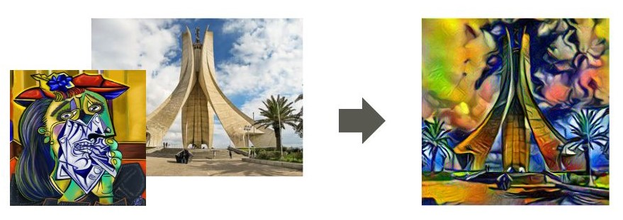
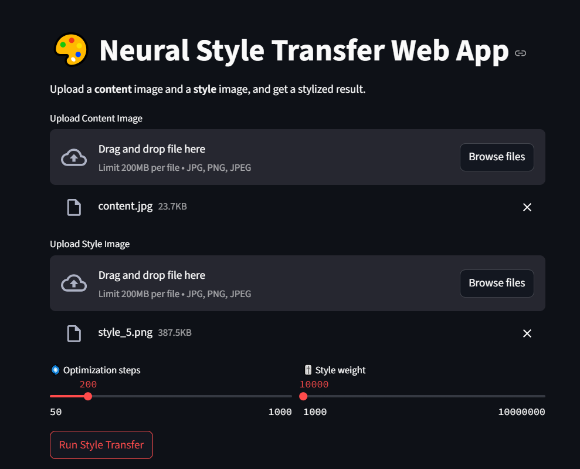
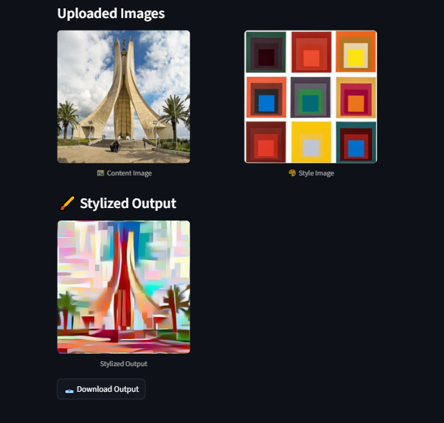

# 🎨 Neural Style Transfer with PyTorch

Apply the **style** of famous artworks to a **content** image using deep learning!

This project implements **Neural Style Transfer (NST)** using a pretrained VGG-19 network in PyTorch. You can run it through a Jupyter notebook or interactively with a responsive Streamlit app. 
👉 **Try the app live:** [neural-style-transfer-ryma.streamlit.app](https://neural-style-transfer-ryma.streamlit.app)




---

## 🧠 Background

Neural Style Transfer is a computer vision technique that combines the **content** of one image with the **style** of another. It was introduced in:

> **A Neural Algorithm of Artistic Style**  
> _Leon A. Gatys, Alexander S. Ecker, Matthias Bethge (2015)_  
> [arXiv:1508.06576](https://arxiv.org/abs/1508.06576)

The method uses a convolutional neural network (VGG-19) to extract features and optimize a new image that mimics the content and style characteristics.

This implementation is heavily inspired by the original code from:  
👉 [Yacine Mahdid's GitHub NST Tutorial](https://github.com/yacineMahdid/artificial-intelligence-and-machine-learning/tree/master/Neural%20Style%20Transfer%20%28Original%20Version%29)

---

## 🗂️ Project Structure

```
├── app.py                   # Streamlit web app
├── notebook.ipynb          # Jupyter notebook
├── data/
│   ├── input/
│   │   ├── content/         # Content images
│   │   ├── styles/          # Style images
│   ├── output/              # Generated outputs organized by style
│   └── result/              # Visual summary (see above)
```

---

## 🚀 How to Use

### 🔬 Notebook (`notebook.ipynb`)

- Run the notebook on **Kaggle** (for free GPU support).
- Change the paths to use your own images if needed.
- It loops through multiple style images applied to one content image.

### 🌐 App (`app.py`)

Launch the interactive Streamlit app locally:

```bash
streamlit run app.py
```
or try it live 👉 [neural-style-transfer-ryma.streamlit.app](https://neural-style-transfer-ryma.streamlit.app)

- Upload your own content and style images.
- Adjust the number of optimization steps and style weight.
- Download the stylized result directly.

---

## 🖼️ Demo Screenshot




---

## ✅ Requirements

- `torch`, `torchvision`
- `streamlit`
- `PIL`, `matplotlib`

---

Feel free to explore, improve, and customize it for your artistic experiments! 🎨✨
